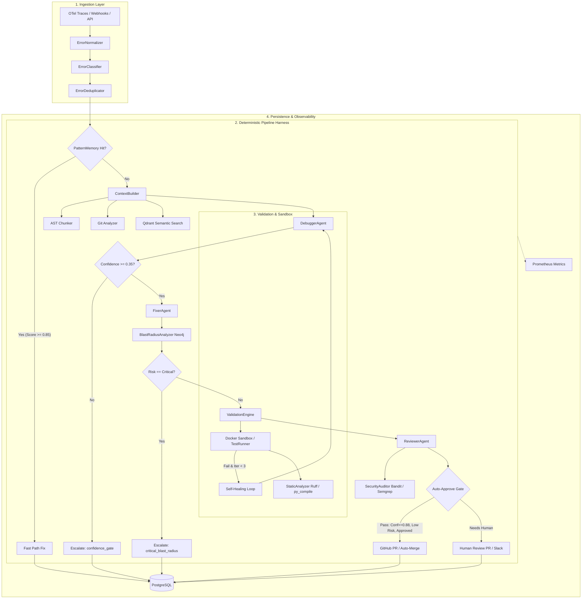

# DARA-v2 Final Architecture Specification (Frozen)

## 1. Executive Overview

**DARA** (Distributed Architecture Root-cause Agent) is an autonomous, deterministic pipeline designed for automated fault triage, root-cause diagnosis, verified patch synthesis, and safe code landing.

DARA embeds specialized Large Language Model (LLM) agents within a rigid, deterministic multi-stage harness. This ensures that non-deterministic neural generation is tightly bounded by compiler verification, regression test suites, static analysis, security auditing, and blast-radius graph traversal before any patch reaches production codebases.

---

## 2. System Architecture & Component Inventory



### Component Classification Matrix

| Component | Layer | Nature | Implementation Status | Isolation Guarantee |
|---|---|---|---|---|
| `ErrorNormalizer` | Ingestion | Deterministic | **IMPLEMENTED** | SHA-256 fingerprinting |
| `ErrorClassifier` | Ingestion | Deterministic / Heuristic | **IMPLEMENTED** | Fixed error taxonomies |
| `ErrorDeduplicator` | Ingestion | Deterministic | **IMPLEMENTED** | DB/Redis signature dedup |
| `ASTChunker` | Context | Deterministic | **IMPLEMENTED** | Tree-sitter AST parsing |
| `GitAnalyzer` | Context | Deterministic | **IMPLEMENTED** | Read-only git blame/log |
| `ContextRetriever` | Context | Vector / Semantic | **IMPLEMENTED** | Qdrant cosine similarity |
| `ContextBuilder` | Context | Deterministic | **IMPLEMENTED** | Token-budget packing |
| `DebuggerAgent` | Agent | LLM (Temp 0.1) | **IMPLEMENTED** | Structured JSON schema |
| `FixerAgent` | Agent | LLM (Temp 0.2) | **IMPLEMENTED** | Unified diff contract |
| `ReviewerAgent` | Agent | LLM + Static (Temp 0.0) | **IMPLEMENTED** | Security pre-filtering |
| `ValidationEngine` | Validation | Deterministic Orchestrator| **IMPLEMENTED** | Enforces all safety gates |
| `SandboxRunner` | Validation | Container Sandbox | **IMPLEMENTED** | Docker `network=none`, `cap_drop=ALL` |
| `TestRunner` | Validation | File-system Sandbox | **IMPLEMENTED** | Ephemeral tempdir pytest |
| `SecurityAuditor` | Security | Deterministic AST/Static | **IMPLEMENTED** | Bandit + Semgrep rules |
| `StaticAnalyzer` | Static | Deterministic Linter | **IMPLEMENTED** | Ruff (E9, S) + py_compile |
| `BlastRadiusAnalyzer` | Graph | Graph Traversal | **IMPLEMENTED** | Neo4j service dependency graph |
| `PatternMemory` | Memory | Deterministic Template | **IMPLEMENTED** | Postgres exact/similar template matching |
| `PostgresClient` | Storage | Async RDBMS | **IMPLEMENTED** | TimescaleDB / PostgreSQL 16 |
| `MetricsRegistry` | Telemetry | Observability | **IMPLEMENTED** | Prometheus counters & histograms |

---

## 3. Data Contracts & Interfaces

### 3.1. Canonical Patch Representation (`PatchFile` & `Fix`)
```python
class PatchFile(BaseModel):
    file_path: str
    unified_diff: str
    lines_changed: int
    change_description: str

class Fix(BaseModel):
    error_id: str
    patches: list[PatchFile]
    total_files_changed: int
    total_lines_changed: int
    fix_explanation: str
    suggested_tests: list[str] = Field(default_factory=list)
    confidence_retained: float
    regression_risk: Literal["low", "medium", "high"]
    strategy: str
    llm_provider: str
```

### 3.2. Structured Pipeline Run Telemetry (`PipelineResult`)
```python
class PipelineResult(BaseModel):
    error_id: str
    status: str                         # "fixed" | "escalated" | "security_blocked" | "template_hit"
    stage_reached: str                  # "ingested" | "analyzing" | "fixing" | "validating" | "fixed" | "escalated"
    stages_completed: list[str]
    root_cause: RootCauseResult | None
    fix: Fix | None
    validation: ValidationReport | None
    review: ReviewResult | None
    fix_id: str | None
    pr_url: str | None
    slack_sent: bool
    blast_risk: str | None
    blast_downstream_count: int
    security_findings: list[str]
    sandbox_iterations: int = 0
    security_retries: int = 0
    escalation_trigger: str | None     # "confidence_gate" | "blast_radius" | "security_blocked" | "sandbox_failure" | "strategy_escalation"
```

---

## 4. Autonomy & Escalation Gate Logic

DARA enforces a strict multi-layer autonomy filter:

1. **Confidence Gate (< 0.35)**:
   If `root_cause.confidence < 0.35` or `suggested_strategy == "human_escalation"`, the pipeline immediately halts, emits an alert to Slack, records `escalation_trigger="confidence_gate"` in PostgreSQL, and prevents code generation.

2. **Critical Blast Radius Gate**:
   If Neo4j graph traversal discovers that a modified function or schema impacts critical downstream services or shared API contracts with high risk, auto-merge is prohibited and `escalation_trigger="critical_blast_radius"` is flagged.

3. **Validation & Sandbox Gate**:
   Every candidate patch is applied to an isolated temp copy or container. Pytest is executed. If tests fail, up to 3 self-healing iterations occur (`enable_self_healing=True`). If failures persist, `escalation_trigger="sandbox_failure"` is marked and PR generation is blocked.

4. **Security Gate (Bandit / Semgrep)**:
   If any HIGH severity security issue (SQL injection, unsafe subprocess execution, command injection, path traversal) is detected, the patch is rejected. The FixerAgent is prompted with specific security violation feedback up to 3 times. If unresolved, `escalation_trigger="security_blocked"` is committed.

5. **Auto-Merge Decision (Threshold = 0.88 Baseline)**:
   Auto-merge is allowed ONLY if:
   - Reviewer recommendation is `approve`
   - Retained confidence $\ge 0.88$
   - Regression risk is `low`
   - Validation passed with 0 blocking issues
   - Sandbox tests passed completely

---

## 5. Architectural Freeze Declaration

All core pipeline stages, data contracts, and safety gates described above are **FROZEN** as of `DARA-v2-FROZEN`.
No breaking interface changes or ad-hoc additions are permitted without formal RFC review.
